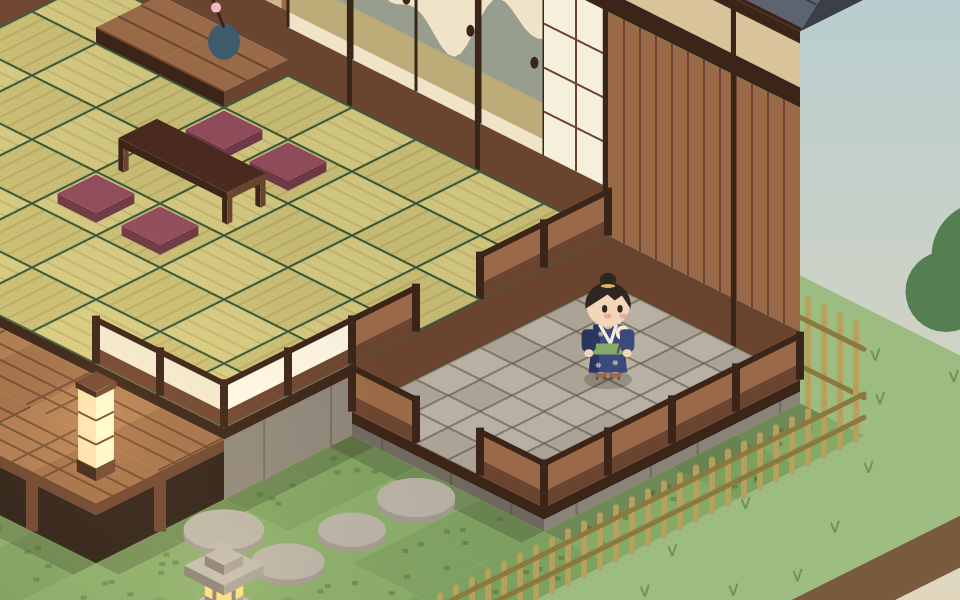
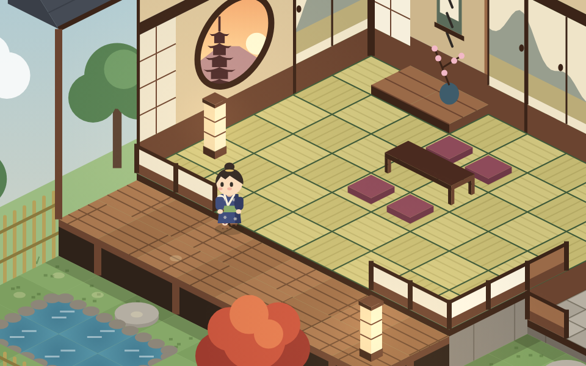
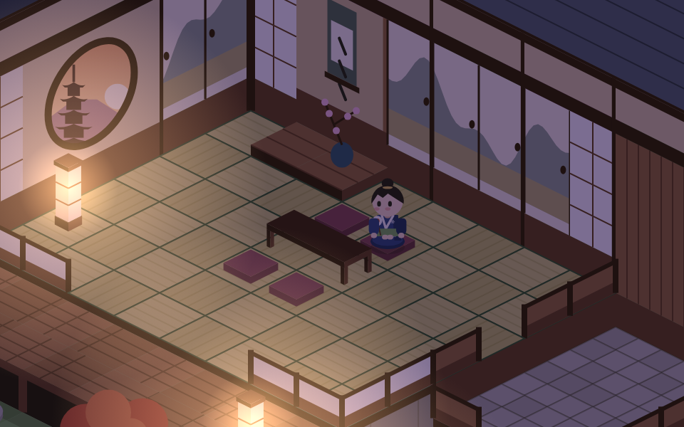

# Tea House

A small Habbo Hotel–style isometric game with a Ghibli-inspired Japanese
look: a little tea house with a tatami room, an entrance hall (genkan), a
veranda (engawa) and a garden. Plain HTML + JavaScript modules + `<canvas>`,
no build step.

Play it at https://jonasbadde.github.io/Repo-JB/

| Standing in the genkan | Walking out to the garden | Sitting at dusk |
|---|---|---|
|  |  |  |

## Controls

| Input | Does |
|---|---|
| Mouse over a tile | Highlights it; the box bottom-left names the area |
| Click a tile | Walk there along the shortest path (a blocked tile: walk next to it) |
| Click a cushion | Walk there and sit down facing the table |
| Drag, mouse wheel / trackpad, arrow keys | Scroll the view (and stop following the avatar until the next click) |
| `Home` | Recentre the view |
| Day/Dusk button or `N` | Switch the time of day |

## Run

Browsers block ES modules on `file://` URLs, so serve the folder:

```sh
python3 -m http.server 8000
# then open http://localhost:8000
```

(`npx serve` or the VS Code "Live Server" extension work too.)

## Tests

The pathfinding has a few checks that need nothing but Node:

```sh
node tests/pathfinding.test.mjs
```

## Changing the layout

The building is drawn as a text map at the top of `js/room.js`, one letter
per tile (`T` tatami, `K` tokonoma, `S` stone, `W` veranda planks, `.` moss,
`:` stepping stone, `P` pond). Change the letters and reload. Walls are
worked out from the map automatically; doorways and steps are listed just
below it. Furniture and what hangs on the back walls are listed in
`js/decor.js`.

## Code layout

| File | Purpose |
|---|---|
| `js/main.js` | Canvas setup, hover picking, click to walk, day/dusk toggle, render loop |
| `js/iso.js` | Isometric projection math (grid ⇄ screen, with heights) |
| `js/room.js` | Building data: the tile map, walls, doorways, walkability |
| `js/decor.js` | Furniture and garden objects, back-wall panels (data only) |
| `js/pathfinding.js` | A* shortest path in 8 directions, following `canStepBetween` |
| `js/avatar.js` | The avatar's position, walking, stepping between heights and sitting |
| `js/avatarRenderer.js` | Draws the avatar (8 directions, walk cycle, sitting) and the path dots |
| `js/camera.js` | Scrolling with drag, wheel and arrow keys; telling clicks from drags; following the avatar |
| `js/renderer.js` | Draws everything in back-to-front (depth-sorted) order |
| `js/floorRenderer.js` | Floor tiles (tatami, stone, planks, moss, pond) and raised-floor sides |
| `js/wallRenderer.js` | Back walls, cut-down front walls and the roof |
| `js/decorRenderer.js` | Furniture and garden objects |
| `js/ground.js` | Grass plot, trees and bamboo fence around the house |
| `js/lighting.js` | Dusk tint and lantern glow |
| `js/scenery.js` | Sky backdrop and the pagoda view through the window |
| `js/palette.js` | Colours for the art style |
| `js/draw.js` | Small shared canvas helpers |

## Roadmap

1. ✅ Isometric room with hover highlight
2. ✅ Tea house: three areas with raised floors, roof, garden, decorations, scrolling, day/dusk
3. ✅ Avatar that walks to a clicked tile (A* pathfinding, sitting on cushions, camera follow)
4. Furniture: place, rotate, pick up
5. Chat bubbles
6. Multiplayer (Node + WebSocket; needs a server, so not on GitHub Pages)
